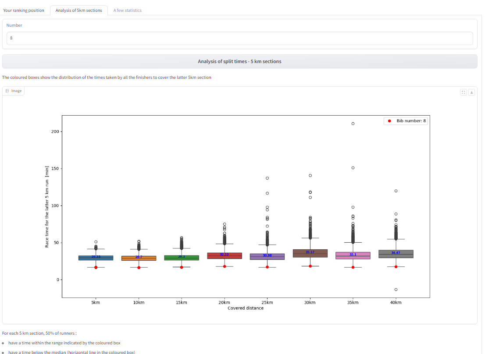
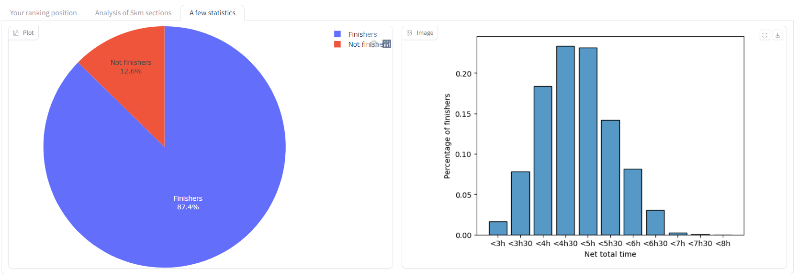

# Marathon-pour-tous-JO-2024-

Pour connaître ton rang et avoir quelques statistiques sur ton marathon pour tous 

Et l'occasion pour moi de mettre en pratique :
-> le web scraping, 
-> le nettoyage de données, 
-> les méthodes de visualisation de données
-> l'utilisation de gradio pour construire une interface utilisateur

